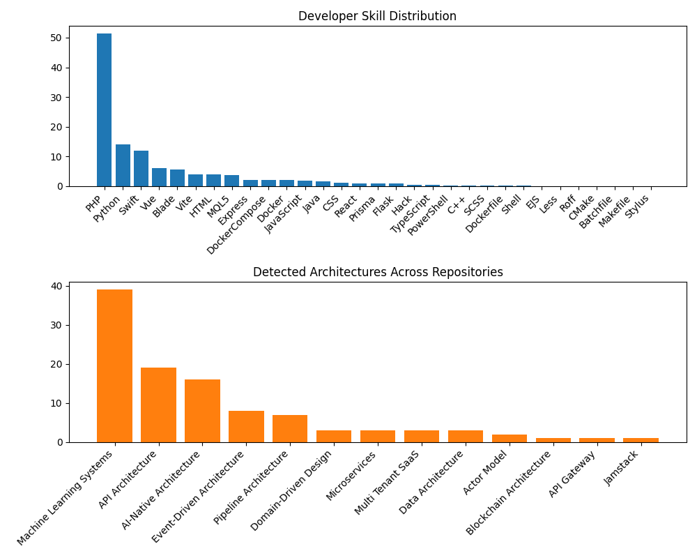

# Yoweli Kachala

*Senior Systems Architect & Backend Engineer with 15+ years of experience building secure, high-availability systems.*

Senior Systems Architect Backend Engineer Senior Systems Architect & Backend Engineer with 15+ years of experience building secure, high-availability systems across Fintech, Health Tech, Government, and Global Enterprise environments (LG, Samsung, MTN). Specialised in transactional systems, payroll platforms, subscription billing logic, and scalable API design. Proven track record in architectural recovery, having fast-tracked a 5-year stalled national system to delivery within 12 months. Expert in high-volume performance, recently reducing processing latency by 88% and doubling operational capacity through strategic automation. Deeply proficient in Laravel/PHP 8+, AWS infrastructure, and CI/CD, with advanced expertise in Financial ML (LSTM/GRU) and ONNX-based production pipelines.

[View styled portfolio (HTML)](index.html)

---
## Architecture footprint

*Inferred patterns detected across repositories*

*Detected across 67 repositories.*

| Architecture | Repos | Share |
|-------------|-------|-------|
| Machine Learning Systems | 39 | 58.2% |
| API Architecture | 19 | 28.4% |
| AI-Native Architecture | 16 | 23.9% |
| Event-Driven Architecture | 8 | 11.9% |
| Pipeline Architecture | 7 | 10.4% |
| Domain-Driven Design | 3 | 4.5% |
| Microservices | 3 | 4.5% |
| Multi Tenant SaaS | 3 | 4.5% |
| Data Architecture | 3 | 4.5% |
| Actor Model | 2 | 3.0% |
| Blockchain Architecture | 1 | 1.5% |
| API Gateway | 1 | 1.5% |
| Jamstack | 1 | 1.5% |

---
## Technical skills

*Weighted by code volume across GitHub*

**Languages**  
**PHP** · **Python** · **Swift** · *Blade* · *HTML* · *MQL5* · *JavaScript* · *Java* · *CSS* · *Hack* · *TypeScript* · *PowerShell* · *C++* · *SCSS* · *Shell* · *Less* · *Roff*

**Tools**  
*Vite* · *Docker* · *Dockerfile* · *CMake* · *Batchfile* · *Makefile*

**Frontend libraries and frameworks**  
*Vue* · *React*

**Other**  
*Express* · *DockerCompose* · *Prisma* · *Flask* · *EJS* · *Stylus*

---
## Skill distribution

*Languages and architectures*

---
## Professional experience

**Founder & Senior iOS Architect (SwiftUI & Firebase)** | *Nov 2025*  
CapeRidaz · City of Cape Town, Western Cape, South Africa

- Implemented secure account deletion flow with clear UI confirmation in AccountTabView, aligning user data handling with emerging privacy expectations and app‑store guidelines
- Added password reset functionality and improved login UX in LoginView, reducing friction for returning users and supporting better account recovery
- Introduced role‑based access control for group management, adding a canEditGroups capability to user roles and updating GroupDetailView so only authorised users can manage groups
- Maintained robust release discipline by incrementally updating the marketing version (3.0.4 → 3.0.5) and keeping project configuration aligned with shipped builds.

**Senior Software Engineer (Native PHP)** | *Apr 2024 – Sep 2025*  
RoomRaccoon Hotel Tech · City of Cape Town, Western Cape, South Africa

- Multi-Tenant SaaS Architecture: Created and optimised scalable backend services for a global SaaS platform, ensuring secure data isolation and performance across a diverse international client base - Database & Transactional Performance: Lead the optimisation of complex transactional workflows and database operations, significantly reducing query latency and improving system throughput - International API Development: Created robust, scalable APIs to support market expansion, focusing on high availability and seamless integration for third-party partners - Agile & Distributed Leadership: Collaborated within a cross-functional, distributed engineering team, driving high standards for code quality and sprint delivery in a fast-paced Agile environment

**Founder & Senior iOS Architect (SwiftUI & Firebase) – CapeRidaz** | *Sep 2023 – Apr 2024*  
CapeEuc · Cape Town, Western Cape, South Africa

- Lead engineer for CapeRidaz, a social ride-tracking app enabling EUC, bike, and micromobility riders to record, analyse, and share rides with a community - Launched end-to-end ride recording & analytics: Designed and shipped GPS ride tracking with background location, media capture, and advanced analytics, supporting 10k+ recorded rides with real-time stats - Scaled real-time features on Firebase: Optimised Firestore data models and indexing for feed, chat, and live location, cutting read costs by ~30% while keeping core screens loading in <200ms - Introduced advanced insights & challenges: Built a challenge engine, leaderboards, and analytics/insight layer that increased weekly active riders by 25% and session length by 18% - Improved engagement via social & sharing: Implemented social feed, comments, and ride/video sharing to external platforms, driving a 40% uplift in shared rides month-over-month - Delivered HealthKit integration: Integrated Apple Health/HealthKit sync (import/export of workouts) with robust privacy and permissions, helping >60% of active users centralise their ride data - Architecture & System Design: Defined MVVM architecture with dedicated Models, ViewModels, Services, and reusable Components, ensuring a modular, testable codebase - Feature Ownership: Owned core product verticals, including ride recording, analytics, challenges, route planning/sharing, and social feed, from design through release and iteration - Quality & Reliability: Established coding standards, logging, and error handling patterns; profiled performance (maps, charts, video generation) and removed bottlenecks affecting scroll and load times

**Senior Backend Engineer** | *Sep 2022 – Aug 2023*  
Emedis SA · Cape Town, Western Cape, South Africa

- Engineered high-performance backend services for LG operations, managing complex logistics, inventory, and financial workflows - Designed and implemented reusable architectural blueprints, establishing a standardised framework that accelerated future system development across the organisation - Successfully blended diverse ERP-style modules, maintaining high data fidelity between inventory management and financial reporting systems

**Senior Back End Developer** | *Sep 2021 – Aug 2022*  
FlexClub · Cape Town, Western Cape, South Africa

- Subscription Ecosystem: Architectured mission-critical backend services managing the full subscription lifecycle, including complex recurring billing logic and automated renewal workflows - System Resiliency: Engineered enhancements to transactional reliability, ensuring 100% data consistency for high-volume financial operations - DevOps Maturity: Standardised deployment pipelines and documentation, significantly increasing production stability and reducing "time-to-market" for new marketplace features - Workflow Standardisation: Audited and refined marketplace architectures to ensure cross-platform consistency and a seamless user experience across the service suite

**Senior Open Source Backend Engineer** | *May 2020 – Jul 2021*  
City of Cape Town · Cape Town, Western Cape, South Africa

- Healthcare Interoperability: Designed and implemented the backend architecture for a large-scale pharmacy system, ensuring seamless integration with diverse clinical platforms - Data Integrity & Compliance: Engineered robust data synchronisation protocols to maintain strict data integrity and clinical accuracy across interconnected healthcare modules - System Synergy: Facilitated complex API integrations between pharmaceutical inventory and patient clinical records to streamline the dispensing workflow - Regulatory Alignment: Architecture backend services with a focus on security and auditability, critical for handling sensitive medical and pharmaceutical data

**Senior Software Development Engineer** | *Dec 2019 – May 2020*  
1-grid · Cape Town Area, South Africa

- Fintech & Billing Integration: Architecture custom modules to extend the WHMCS billing platform, automating complex financial workflows for enterprise clients - Secure Payment Processing: Successfully integrated the PayFast Payment Gateway, ensuring secure, encrypted transaction processing and PCI-DSS compliance - Automated Domain Workflows: Engineered API-based domain verification and provisioning workflows, reducing manual intervention and accelerating service delivery - Financial Accuracy: Audited and refined automated billing logic, significantly improving billing accuracy and operational reliability for recurring revenue streams

**Senior Backend & Frontend Engineer** | *Feb 2019 – Nov 2019*  
GoMetro · Cape Town Area, South Africa

- Architectured robust backend services for a comprehensive fleet management platform, focusing on scalability and data consistency - Architected and built a real-time vehicle tracking module using ReactJS, enabling live monitoring of fleet assets with high precision using a PHP/Laravel backend - Significantly improved CI/CD pipelines, leading to higher production deployment stability across staging, QA, and production environments, decreasing deployment failures by 70%

**Senior Enterprise Systems Developer** | *Jan 2016 – Feb 2019*  
Double Eye · Cape Town, Western Cape, South Africa

- Successfully guided and delivered 7 enterprise-scale projects across the telecommunications and public sectors, serving as the Technical Lead for 2 high-priority initiatives
- Standardised the QA workflow and environment parity, reducing 'it works on my machine' bugs and accelerating the release cycle - Led the development of a critical UK National Health Service (NHS) health system initiative, ensuring backend solutions met stringent compliance and data integrity standards - Engineered and supported robust backend systems for tier-1 telecommunications providers, including Samsung, Cell C, Glocel, and MTN - Streamlined development cycles by implementing CI/CD integration and automated QA workflows, reducing manual testing overhead and improving release stability

**Lead Developer (Systems Architect & Backend Engineer)** | *Mar 2012 – Dec 2015*  
SchoolAlert · Cape Town Area, South Africa

- Managed platform re-architecture of a high-volume messaging platform, integrating SendGrid (bulk mail), Infobip (SMS), and USSD services - Re-engineered processing logic to reduce message delivery latency by 88% (from 3 hours to under 20 minutes) - Automated SMS failure handling and support workflows, reducing operational costs by 25% and enabling the successful merger of two regional offices - Scaled backend automation to the point that manual call centre functions were consolidated, resulting in significant overhead reduction and streamlined operations - Architectured a customer support module that doubled staff capacity, increasing daily client visits from 2 to 4 per person

**Early Career – Systems & Backend Engineering** | *Jan 2006 – Feb 2012*  
Intu2Ko Complete IT Services & Globe Computer Systems LTD · Cape Town, Western Cape, South Africa

- Project Recovery: Rescued a stalled tender processing system that had been delayed for 5 years; fast-tracked development to deliver functional demos within the first 12 months - Platform Recovery: Rescued a stalled tender processing system delayed for 5 years, fast-tracking development to deliver functional demos within 12 months - Operational Efficiency: Engineered a customer support system that doubled field productivity, increasing client visit capacity from 2 to 4 per person daily - Public Sector Infrastructure: Developed and deployed national-scale payroll and HR systems for the Government of Malawi - Platform Engineering: Built backend components for B2B trading and insurance platforms, managing end-to-end hosting and infrastructure - Leadership: Took full ownership of deployments and user training within the first year of tenure

---
## Education

**B-Tech Degree In Information Technology**  
Cape Peninsula University of Technology

**Management Information Systems**  
University of Malawi (Polytechnic)

---
## Certifications

**Cisco Certified Networking Associate**  
Cisco · *Issued Nov 2005*

**PHP**  
TestDome · *Issued Jan 2019*

---
## Featured projects

*Public repositories, summarized from GitHub*

- **[joel767443](https://github.com/joel767443/joel767443)** — No README summary available.  
  *Tech:* HTML (75.85%), PHP (24.15%)
- **[github-personal-branding](https://github.com/joel767443/github-personal-branding)** — No README summary available.  
  *Tech:* JavaScript (75.01%), CSS (11.28%), HTML (6.71%), EJS (6.48%)
- **[view-bridge](https://github.com/joel767443/view-bridge)** — No README summary available.  
  *Tech:* PHP (100.0%)
- **[router-symfony](https://github.com/joel767443/router-symfony)** — No README summary available.  
  *Tech:* PHP (100.0%)
- **[rate-limit](https://github.com/joel767443/rate-limit)** — No README summary available.  
  *Tech:* PHP (100.0%)
- **[queue-redis](https://github.com/joel767443/queue-redis)** — No README summary available.  
  *Tech:* PHP (100.0%)
- **[openapi](https://github.com/joel767443/openapi)** — No README summary available.  
  *Tech:* PHP (100.0%)
- **[observability](https://github.com/joel767443/observability)** — No README summary available.  
  *Tech:* PHP (100.0%)
- **[middleware](https://github.com/joel767443/middleware)** — No README summary available.  
  *Tech:* PHP (100.0%)
- **[jwt-auth](https://github.com/joel767443/jwt-auth)** — No README summary available.  
  *Tech:* PHP (100.0%)
- **[messenger-bridge](https://github.com/joel767443/messenger-bridge)** — No README summary available.  
  *Tech:* PHP (100.0%)
- **[http-kernel](https://github.com/joel767443/http-kernel)** — No README summary available.  
  *Tech:* PHP (100.0%)

---
*Generated automatically by [github-developer-intelligence](https://github.com/joel767443/github-developer-intelligence).*

