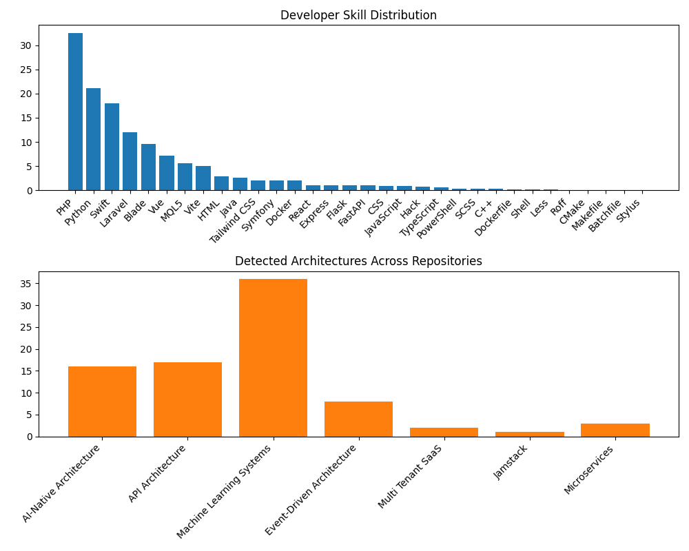

## Yoweli Kachala

**Senior Systems Architect • Full Stack Engineer**

Senior systems architect and full stack engineer focused on AI-native products, trading and quantitative tools, and scalable SaaS platforms.

### Where I add the most value

- **AI & trading systems**: Python/MQL5 engines, backtesting, and automation.
- **Scalable APIs & backends**: PHP/Laravel, microservices, Docker-based deployments.
- **End-to-end product delivery**: from prototype to production across web, mobile, and cloud.

---

## What I’m looking for

- Senior backend or full stack roles building AI-powered products or data-heavy systems.
- Early engineering hire or founding engineer roles at product-focused startups.
- Positions where I own architecture decisions and help teams ship reliably to production.

---

## Impact highlights

- Designed and maintained AI/ML and quantitative trading projects across **36** repositories.
- Built and integrated REST-style APIs and backend services in **17**+ codebases using PHP/Laravel, Python, and JavaScript.
- Applied service-oriented and microservice patterns in **3** projects with Dockerized deployments.
- Curated and actively maintain a portfolio of **49** repositories that showcase production-grade code, automation, and CI/CD.

---

## From my CV

{{ cv_summary_section }}

---

## Technical profile at a glance

- **Repositories analyzed**: 49
- **Architectures used in production projects**: Machine Learning Systems (36), API Architecture (17), AI-Native Architecture (16)
- **Top languages by usage**: PHP (32.54%), Python (21.32%), Swift (17.94%), Laravel (12%), Blade (9.55%)

These metrics are derived automatically from my GitHub activity and give a quick view of where I spend most of my time.

---

## Technologies I work with

Heavier percentages indicate where I have the deepest hands-on experience; PHP, Python, and Swift are my most-used languages.

| Technology | Usage |
|-----------|-------|
| PHP | 32.54% |
| Python | 21.32% |
| Swift | 17.94% |
| Laravel | 12% |
| Blade | 9.55% |
| Vue | 7.15% |
| MQL5 | 5.52% |
| Vite | 5% |
| Java | 2.56% |
| HTML | 2.55% |
| Tailwind CSS | 2% |
| Symfony | 2% |
| Docker | 2% |
| React | 1% |
| Express | 1% |
| Flask | 1% |
| FastAPI | 1% |
| CSS | 0.92% |
| JavaScript | 0.86% |
| Hack | 0.73% |
| TypeScript | 0.63% |
| PowerShell | 0.38% |
| SCSS | 0.29% |
| C++ | 0.29% |
| Dockerfile | 0.24% |
| Shell | 0.16% |
| Less | 0.14% |
| Roff | 0.1% |
| CMake | 0.04% |
| Makefile | 0.04% |
| Batchfile | 0.03% |
| Stylus | 0.01% |

---

## Architecture experience

I design and work with architectures that support real-world constraints like latency, throughput, and iterative delivery across ML systems, APIs, and microservices.

Across 49 repositories, recurring architecture patterns include Machine Learning Systems, API Architecture, AI-Native Architecture.

- **Machine Learning Systems**: 36 repos
- **API Architecture**: 17 repos
- **AI-Native Architecture**: 16 repos
- **Event-Driven Architecture**: 8 repos
- **Microservices**: 3 repos
- **Multi Tenant SaaS**: 2 repos
- **Jamstack**: 1 repos

---

## Skill graph

_Skill graph highlighting strongest technologies: PHP, Python, Swift._

---

## How this portfolio is generated

This portfolio is generated from my GitHub repositories using custom Python tooling in the `scripts/` folder, combining language stats, architecture detection, and project summaries.
