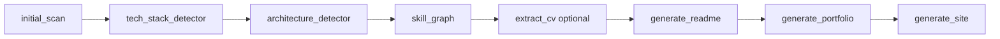

# GitHub Developer Intelligence

Python tooling that analyzes your GitHub repositories and generates a data-driven portfolio (README, static site, skill graphs) from language stats, architecture detection, and optional CV data.

## Features

- **Repository scan**: Fetches all user repos via GitHub API; aggregates language bytes and README summaries.
- **Tech stack detection**: Languages plus optional framework detection from repo root files (via `scripts/frameworks.json` if present).
- **Architecture detection**: Keyword-based detection (ML, API, microservices, Jamstack, etc.) over repo names, descriptions, topics, and file trees.
- **CV extraction**: Parse LinkedIn-style CV PDF to JSON (`extract_cv.py`) for name, skills, experience, and education.
- **Outputs**: `data/*.json`, `graphs/skills_chart.png`, generated portfolio README (from template), `portfolio/README.md` and `portfolio/index.html`, `site/site.html` (portfolio site using `site/css/styles.css`).
- **Optional**: `scripts/test_post.py` for LinkedIn API test post (requires `ACCESS_TOKEN`, `PERSON_ID`).

## Prerequisites

- Python 3.x
- [GitHub Personal Access Token](https://github.com/settings/tokens) (for higher rate limits and private repos)

## Installation

```bash
git clone <repo-url>
cd github-developer-intelligence
python -m venv .venv
source .venv/bin/activate   # Windows: .venv\Scripts\activate
pip install -r requirements.txt
```

**Dependencies** (from `requirements.txt`): `requests`, `python-dotenv`, `matplotlib`, `jinja2`, `ez-parse`, `pdfminer.six`, `markdown`.

## Configuration

1. **Environment**: Copy `example.env` to `.env` and set:
   - `GITHUB_TOKEN` — required for scan and framework/architecture steps.
   - `ACCESS_TOKEN`, `PERSON_ID` — only for LinkedIn test post (`scripts/test_post.py`).

2. **Script-specific**: In `scripts/architecture_detector.py`, set `YOUR_GITHUB_USERNAME` (line 14) if `data/projects.json` does not contain `full_name` for each repo (e.g. if you run an older scan).

3. **Optional files**:
   - `scripts/frameworks.json` — not in repo; if present, `tech_stack_detector.py` uses it for framework/tool detection from repo root file names.
   - `data/skill_categories.json` — created by `generate_portfolio.py` if missing; edit to group skills.
   - `reports/capability_report.txt` — optional; if present, `generate_readme.py` uses "Total Projects:" and "Estimated Complexity Score:" in the generated portfolio README.

## Project structure

| Path | Description |
|------|-------------|
| `scripts/` | Python entry points and `common.py` (paths, `load_json`, `render_template`, `get_display_name`, `get_github_user_name`) |
| `data/` | Generated: `projects.json`, `tech_stack.json`, `architecture.json`, `cv_extracted.json`, optional `skill_categories.json`; `data/cache/files/` for architecture file-tree cache |
| `templates/` | `README.template.md`, `site.md`, optional CV PDF |
| `site/` | Generated `site/site.html`; static `site/css/styles.css`, `site/img/` |
| `portfolio/` | Generated `README.md` and `index.html` (plus skills chart) |
| `reports/` | Optional `capability_report.txt` |
| `graphs/` | Generated `skills_chart.png` |

## Workflow

Run scripts in this order. Later steps depend on outputs from earlier ones.



1. **initial_scan.py** — Fetches user repos, languages, README summaries; writes `data/projects.json`. Requires `GITHUB_TOKEN`.
2. **tech_stack_detector.py** — Reads `data/projects.json`; aggregates languages, optionally detects frameworks; writes `data/tech_stack.json`.
3. **architecture_detector.py** — Reads `data/projects.json`; fetches file trees (cached in `data/cache/files/`); keyword detection; writes `data/architecture.json`. Set `YOUR_GITHUB_USERNAME` if projects lack `full_name`.
4. **skill_graph.py** — Reads `data/tech_stack.json` and `data/architecture.json`; writes `graphs/skills_chart.png`.
5. **extract_cv.py** (optional) — PDF to `data/cv_extracted.json`; improves name/headline/experience in generated README and site.
6. **generate_readme.py** — Uses `templates/README.template.md`, `data/*.json`, `reports/`; writes **portfolio/README.md** (template-based profile).
7. **generate_portfolio.py** — Writes `portfolio/README.md`, `portfolio/index.html`, `portfolio/skills_chart.png`; uses `data/skill_categories.json` (creates default if missing).
8. **generate_site.py** — Writes `site/site.html` from `templates/site.md` and data (CV, projects, tech stack, skill categories).

**Example (from repo root):**

```bash
python scripts/initial_scan.py
python scripts/tech_stack_detector.py
python scripts/architecture_detector.py
python scripts/skill_graph.py
python scripts/extract_cv.py templates/cv.pdf    # optional
python scripts/generate_readme.py
python scripts/generate_portfolio.py
python scripts/generate_site.py
```

## Scripts reference

| Script | Purpose | Main inputs | Main outputs |
|--------|---------|-------------|--------------|
| initial_scan | Fetch repos + languages + README summaries | GITHUB_TOKEN | data/projects.json |
| tech_stack_detector | Aggregate languages + detect frameworks | data/projects.json, optional frameworks.json | data/tech_stack.json |
| architecture_detector | Detect architecture patterns | data/projects.json | data/architecture.json |
| skill_graph | Plot skills + architectures | data/tech_stack.json, data/architecture.json | graphs/skills_chart.png |
| extract_cv | Parse CV PDF to JSON | templates/cv.pdf (or path) | data/cv_extracted.json |
| generate_readme | Render portfolio README | templates/README.template.md, data/*, reports/ | portfolio/README.md |
| generate_portfolio | Build portfolio Markdown + HTML | data/*, skill_categories | portfolio/README.md, portfolio/index.html |
| generate_site | Build portfolio site HTML | templates/site.md, data/* | site/site.html |
| test_post | LinkedIn API test post | ACCESS_TOKEN, PERSON_ID | (API call only) |

## Outputs

- **Data**: `data/projects.json`, `data/tech_stack.json`, `data/architecture.json`, `data/cv_extracted.json`, `data/skill_categories.json`.
- **Generated content**: `portfolio/README.md` (template-based and/or from generate_portfolio), `portfolio/index.html`, `site/site.html`, `graphs/skills_chart.png`.

`.env`, `data/`, `reports/`, `site/`, `portfolio/`, and `graphs/` are in `.gitignore`; generated outputs are local unless you force-add them.

## Customization

- Edit `templates/README.template.md` and `templates/site.md` for narrative and structure.
- Edit `data/skill_categories.json` to group technologies for the portfolio.
- Add `scripts/frameworks.json` (object mapping framework names to list of file patterns) to enable framework detection in `tech_stack_detector.py`.
