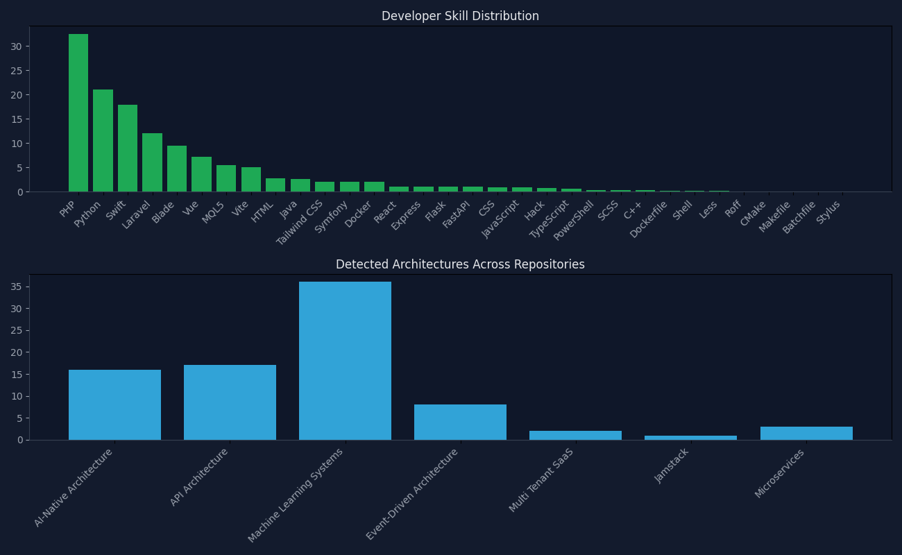

# Contact Durbanville

*AI-Augmented Software Engineer*

Building AI-native systems, microservices, Laravel applications, and data-driven trading tools. This portfolio is generated directly from my GitHub activity to reflect how I actually ship software.

---

## Architecture footprint

*Inferred patterns detected across repositories*

*Detected across 49 repositories.*

| Architecture | Repos | Share |
|-------------|-------|-------|
| Machine Learning Systems | 36 | 73.5% |
| API Architecture | 17 | 34.7% |
| AI-Native Architecture | 16 | 32.7% |
| Event-Driven Architecture | 8 | 16.3% |
| Microservices | 3 | 6.1% |
| Multi Tenant SaaS | 2 | 4.1% |
| Jamstack | 1 | 2.0% |

---

## Technical skills

*Weighted by code volume across GitHub*

**Languages**  
**PHP** · **Python** · **Swift** · *Blade* · *MQL5* · *HTML* · *Java* · *CSS* · *JavaScript* · *Hack* · *TypeScript* · *PowerShell* · *SCSS* · *C++* · *Shell* · *Less* · *Roff*

**Tools**  
*Vite* · *Docker* · *Dockerfile* · *CMake* · *Makefile* · *Batchfile*

**Frontend libraries and frameworks**  
*Vue* · *Tailwind CSS* · *React*

**Backend libraries and frameworks**  
**Laravel** · *Symfony* · *Express* · *Flask* · *FastAPI*

**Other**  
*Stylus*

---

## Skill distribution

*Languages and architectures*

---

## Professional experience

*No experience data.*

---

## Education

*No education data.*

---

## Certifications

*None listed.*

---

## Featured projects

*Public repositories, summarized from GitHub*

- **[emendis-php-assessment](https://github.com/joel767443/emendis-php-assessment)** — PHP OOP solution for calculating transport container requirements with clean object-oriented design  
  *Tech:* PHP (100.0%)
- **[eugene-property-management](https://github.com/joel767443/eugene-property-management)** — Laravel 8 platform for managing properties, service providers, scheduling, messaging, and payments  
  *Tech:* PHP (50.03%), Blade (40.86%), HTML (9.11%)
- **[github-developer-intelligence](https://github.com/joel767443/github-developer-intelligence)** — Python toolkit that analyzes GitHub repos and generates developer portfolios with profile READMEs, skill graphs, and capability reports  
  *Tech:* Python (77.68%), CSS (11.7%), HTML (10.61%)
- **[joel767443](https://github.com/joel767443/joel767443)** — joel767443  
  *Tech:* Unknown
- **[raccoon-php-vue-crud](https://github.com/joel767443/raccoon-php-vue-crud)** — Full-stack CRUD app with custom PHP MVC backend and Vue 3 single-page frontend  
  *Tech:* Vue (49.04%), PHP (43.0%), CSS (3.99%), JavaScript (3.14%)
- **[yow-php-mini-framework](https://github.com/joel767443/yow-php-mini-framework)** — Lightweight PHP MVC framework built from scratch with custom routing, layout-based view rendering, and controller architecture  
  *Tech:* PHP (71.99%), Hack (28.01%)

---

*Generated automatically by [github-developer-intelligence](https://github.com/joel767443/github-developer-intelligence).*
